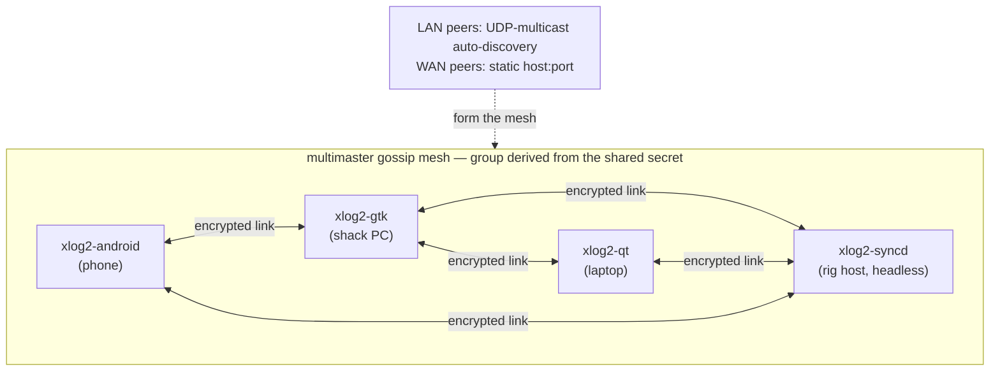

**hamtools** is a small suite of Linux ham-radio tools I wrote to run my station over the network — **cwsd** (a rig daemon), **xlog2** (a logging program) and **usb-paddles** (Morse-paddle firmware). Each is useful on its own; wired together they turn one radio into a fully network- and internet-operable station. Here's how they came to be, followed by a tour of each piece and the one design decision I'm proudest of.

## A bit of history

Everything started when Matei, YO3GEK, tried to get me into CW contesting. Being a Linux user, I tried the ubiquitous [tlf](https://tlf.github.io/) + [cwdaemon](https://github.com/acerion/cwdaemon/) + [rigctld](https://hamlib.sourceforge.net/html/rigctld.1.html) mix, but it quickly became annoying to have so many moving parts that randomly crashed. Long story short, that was the birth of **cwsd**. In its first incarnation it was just a simple binary interfacing the rig with hamlib and exposing a cwdaemon and a rigctld facade.

Matei and I tested it throughout contests, pairing it up with tlf for net keying and rig control. This brought to light bugs that were ironed out and further ideas that I slowly implemented.

And for a while, that was good. Right until I got annoyed by logging.

I was using [xlog](https://www.nongnu.org/xlog/), which is sadly no longer maintained and is stuck on GTK2 — which looked awful on a modern distro. After a short attempt at porting it to GTK3, I had an idea: what if, instead of wasting effort porting xlog to GTK3, I just wrote my own logger that could import xlog data? I would then be in control, able to quickly fix bugs or add any feature my heart desired. And thus **xlog2** was born (quite an original name, I know).

Being a GNOME user, I was inclined to use GTK4 for a modern, slick UI, but after a small flamewar with Matei I decided to also go for a Qt frontend. Being the decent software engineer that I am, I went for an MVP approach, building a UI-toolkit-agnostic core library and two separate frontends on top of it — an architectural decision that paid off many times over in the long run. Claude Code graciously helped with all the dirty, boring boilerplate.

After I had a first version running on both frontends that could import my QSO history from xlog, I decided I would use **xlog2** exclusively from then on. That way I would feel firsthand what frustrated me most and fix or implement the missing features — the proverbial eating your own dog food.

The IC-7300 sat on my work desk, connected to the desktop PC I was developing on, until I decided to keep the rig always on and connect it over USB to a mini server running **cwsd**. That let me work on the logger from the laptop, in various spots around the house. This posed another problem: I wanted to add band switching and frequency control to the logger, but it was cumbersome to develop in the living room and then run upstairs to the station to check that the frequency/band switching worked as intended.

So I decided to add audio streaming to **xlog2** — which of course required building support in **cwsd** too. Once that was working, I could operate from the couch using macros defined in the logger. That wasn't entirely to my taste, though; I wanted true remote keying — being able to use an actual paddle to key the rig remotely. More than that, it had to feel seamless: no perceived lag whatsoever!

After a couple of failed ideas and iterations, I ended up writing a small microcontroller firmware acting as a **USB paddle interface**. The idea was simple: you plug the paddles into the module, connect that to the PC running **xlog2**, and you can work as if it were plugged in at the station. The implementation, however, was more challenging than I'd assumed — but it all worked out in the end (technical details later on).

So now I had a logger that could control my rig, query rig data, listen to its audio, and key it as if I were there. A couple of other features followed: a map showing the location of the DX, LoTW and qrz.com integration, a Morse decoder à la CW Skimmer, and a waterfall that was nice to look at.

The next thing I got annoyed by was switching from laptop to desktop: the logger ran just fine on both at the same time, but the logbook wasn't synchronized, and I did not want to deal with that manually. It took a couple of attempts, but I ended up with something I enjoy a lot: a distributed, decentralized, self-discovering mesh — log a contact on any **xlog2** instance and it turns up on all the others. (More on how it holds together further down.)

So, with things close to perfect for my needs, a question started bugging me: what if I used the desktop and the laptop alternately, and **xlog2** was never online on both at the same time to sync the logbook? And that's how **xlog2-syncd** was born — an exceptionally low-hanging fruit, thanks to the architectural decisions taken at the start. **xlog2-syncd** is a service running on the same server as **cwsd**, always up and quietly making sure all QSOs and qrz.com queries are cached and served to any mesh member that needs them.

I could finally take a breath and enjoy the fruits of my labour. But wait — what about field logging? I have an Elecraft KX3 and a QRP Labs QMX+, and I sometimes like to operate from remote places. I used [VLS](https://www.qrz.com/db/SP7VLS) before — an exquisite logging app — but I had to jump through many steps to get the field log into xlog. But now that I have a logger …

And that's where the very same architectural decisions paid off. With the help of Claude, I put together an Android frontend in Kotlin on top of the same **xlog2** core library. Soon I had logging synchronized across all my devices, which was very satisfying. But wait — why not attempt something crazy, like remote operation from the phone itself? Would that even work? Only one way to find out: first **cwsd**'s audio streaming was integrated into the Android app, followed by the remote keyer. It was amazing to plug the keyer interface into my phone and actually have a QSO using the **xlog2** frontend running on the phone!

At this point things felt like they were in a state where I could share the whole thing with fellow hams, who might make use of one component or the whole stack. It is all free, and always will be.

## Components

Here are the components collectively known as the **hamtools** suite. What follows is a tour of how the pieces fit — what each one does, the protocols between them, and the one design decision I'm proudest of (it's about keying CW over a jittery network without it sounding like garbage).

### cwsd

**cwsd** is the piece that lives next to the radio. It links [hamlib](https://hamlib.sourceforge.net/) for CAT control and turns a single USB-connected transceiver (developed against the Icom IC-7300) into a set of independent, individually-toggled network services, each on its own port:

| Service | Port | Default | Purpose |
|---------|------|---------|---------|
| `rigctld` | TCP 4532 | on | hamlib rigctld protocol — query/set frequency, mode, PTT, VFO (WSJT-X, fldigi, xlog2, …) |
| `cwdaemon` | UDP 6789 | on | receive text and key it as Morse (DTR = key, RTS = PTT) |
| audio stream | UDP 7355 | off | capture rig RX audio, Opus-encode, fan out to subscribers |
| remote key | UDP 6790 | off | replay timestamped paddle edges — real keying over the internet |

Because the first two speak the *standard* rigctld and cwdaemon protocols, cwsd is useful well beyond this stack: point WSJT-X or fldigi at `RIGHOST:4532` and you're controlling a rig on another machine.

> `cwdaemon` and `remote_key` both drive the same DTR/RTS control lines, so if you enable both on a given serial device, try not to send a CW macro while using remote keying — or vice versa. They're alternative keying front-ends which should not be used at the same time.

**Where to get it & install.** On current Ubuntu releases it's a package on my PPA — no compiling:

```sh
sudo add-apt-repository ppa:benishor/hamtools
sudo apt update
sudo apt install cwsd
```

That drops in the binary, a `systemd` service unit and a sample config. On other distributions (or Raspberry Pi OS) grab a self-contained static `x86_64`/`arm64` binary from the [releases](https://github.com/yo6ssw/cwsd/releases), or build from source — you need CMake ≥ 3.25, a C++20 compiler, and the hamlib / ALSA / Opus development libraries:

```sh
sudo apt install libhamlib-dev libasound2-dev libopus-dev cmake build-essential
git clone https://github.com/yo6ssw/cwsd.git
cd cwsd
cmake -S . -B build -DCMAKE_BUILD_TYPE=Release
cmake --build build -j
sudo cmake --install build
```

> One scar worth passing on: hamlib breaks its ABI within the 4.x series while keeping the `libhamlib.so.4` soname, so **after any hamlib upgrade you must rebuild cwsd**. Otherwise the old binary keeps linking and running — audio still streams — but the `rigctld` service silently returns nothing to every command and CAT clients just time out. "It still runs" is not proof it works.

**Configure.** Despite the `rc` name, the config is YAML. From the PPA the service reads a *system* config at `/etc/cwsd/cwsdrc`, so copy the shipped sample and edit it:

```sh
sudo cp /etc/cwsd/cwsdrc.sample /etc/cwsd/cwsdrc
sudo editor /etc/cwsd/cwsdrc     # set rig.port and rig.model
```

Each service has its own `enabled` flag and port; `rig.model` is the hamlib model number (`3073` = IC-7300) and `rig.port` is the serial device:

```yaml
rig:
  port: /dev/icom7300      # stable udev symlink to the rig's serial device
  model: 3073              # hamlib rig model number (3073 = IC-7300)
cwdaemon:
  enabled: true
  port: 6789
  initial_wpm: 40
rigctld:
  enabled: true
  port: 4532
audio:
  enabled: false
  device: pipewire         # RX via PipeWire, shared with WSJT-X (or plughw:0,0 for the raw card)
  port: 7355               # clients subscribe by sending a datagram here
  sample_rate: 8000        # Opus rates only: 8000/12000/16000/24000/48000
remote_key:
  enabled: false
  port: 6790
  playout_ms: 150          # jitter-buffer depth; the rig lags the operator by this much
```

The package installs a `cwsd.service` unit but deliberately **doesn't enable or start it** — nothing runs until you've written the config above and then:

```sh
sudo systemctl enable --now cwsd
journalctl -u cwsd -f             # follow the logs
```

The service runs as an unprivileged, transient `DynamicUser` (no root, no login account) that's added to the `dialout` and `audio` groups so it can reach the rig's serial line and sound card, and granted just enough real-time capability for the keyer thread. The package also ships a udev rule that gives the rig a stable `/dev/icom7300` symlink, so the config doesn't depend on USB enumeration order.

For a quick manual run instead — handy while testing — just launch it in the foreground with `cwsd` (or `cwsd -d` to daemonize). Run that way, with no `--config`, it falls back to a per-user `~/.config/cwsdrc`; the systemd unit passes `--config /etc/cwsd/cwsdrc` explicitly.

### xlog2

**xlog2** is the logger and the operator console — a desktop amateur-radio logging program (a modern clone of [xlog](https://www.nongnu.org/xlog/), in C++20), built as a **toolkit-neutral core with two interchangeable frontends**: **xlog2-gtk** (GTK 4) and **xlog2-qt** (Qt 6). Both read and write the same `.xlog` SQLite logbooks and the same settings, so you can switch between them freely. On its own it handles the usual logging chores — live dupe detection, frequency→band, ADIF import/export, per-band/mode stats, DXCC from `cty.dat`, QRZ.com prefill, LoTW upload/confirmation via `tqsl`. Point it at a running **cwsd** and it also becomes the station's control surface:

| Talks to | Via | For |
|----------|-----|-----|
| cwsd / rig | rigctld TCP 4532 | CAT — frequency, mode, PTT, band switching |
| cwsd | cwdaemon UDP 6789 | send CW — F1–F9 macros and typed text |
| cwsd | remote_key UDP 6790 | real paddle keying over the network |
| cwsd | Opus UDP 7355 | RX audio playback + the CW Skimmer decoder |
| other xlog2 nodes | multimaster mesh | peer-to-peer logbook sync |
| QRZ.com · LoTW · DX-cluster | HTTPS · `tqsl` · telnet | lookups, confirmations, spots |

**Where to get it & install.** Same PPA as cwsd — pick a frontend:

```sh
sudo add-apt-repository ppa:benishor/hamtools
sudo apt update
sudo apt install xlog2-gtk        # GTK 4 frontend (or: xlog2-qt for Qt 6)
```

Optional extras: `xlog2-data` (world-map coastline) and `xlog2-syncd` (the headless sync peer — more below). For Debian / Raspberry Pi OS / anything non-Ubuntu, grab the self-contained **Qt AppImage** from the [releases](https://github.com/yo6ssw/xlog2/releases) (it bundles Qt 6, so it doesn't need a recent system GTK; LoTW still needs `tqsl` on the host). Or build from source — a C++20 compiler, CMake ≥ 3.16, and gtkmm-4 and/or Qt 6 plus the SQLite / Hamlib / libcurl / Opus / PipeWire / D-Bus / libsodium dev packages:

```sh
sudo apt install build-essential cmake pkg-config \
    libgtkmm-4.0-dev qt6-base-dev \
    libsqlite3-dev libhamlib-dev libcurl4-openssl-dev \
    libopus-dev libasound2-dev libpipewire-0.3-dev libdbus-1-dev \
    libsodium-dev
sudo apt install tqsl                 # runtime only, for LoTW upload
git clone --recurse-submodules https://github.com/yo6ssw/xlog2.git
cd xlog2
cmake -S . -B build && cmake --build build -j     # builds both frontends
```

Clone **with `--recurse-submodules`** — the sync mesh pulls in `multimaster`. Build just one frontend with `-DXLOG_BUILD_GTK=OFF` or `-DXLOG_BUILD_QT=OFF`; the binaries land at `build/xlog2-gtk` and `build/xlog2-qt`.

**Configure.** Unlike cwsd, xlog2 is configured from its in-app **Settings** dialog rather than a hand-edited file — but it all lands in a plain INI at `~/.config/xlog2/layout.ini`, and your data (the `default.xlog` logbook, plus optional `cty.dat` for DXCC and `master.scp` for the Skimmer) lives under `~/.local/share/xlog2/`. The settings worth knowing:

- **Station** — your callsign and Maidenhead locator.
- **Rig / CW / audio** — the **cwsd** host, so CAT (4532), CW keying (cwdaemon 6789), paddle keying (remote_key 6790) and the RX Opus stream (7355) all point at the box by your radio.
- **Lookups** — QRZ.com credentials; drop `cty.dat` and `master.scp` into the data dir.
- **Sync** — the one knob that matters: set the **same shared secret on every node** and they form one encrypted, self-discovering mesh. In `layout.ini` that's:

```ini
[sync]
secret = a-high-entropy-shared-secret     # identical on every node
```

For an always-on backup that keeps the logbook merged even when your machines are asleep, install the headless peer: `sudo apt install xlog2-syncd`, set the same `[sync] secret`, then `systemctl --user enable --now xlog2-syncd` (with `sudo loginctl enable-linger "$USER"` so it survives logout and runs at boot). Follow it with `journalctl --user -u xlog2-syncd -f`.

There's a mobile frontend, too: **xlog2-android**, a Kotlin/Jetpack Compose app that runs the *same* `xlog_core` over JNI — so a QSO logged on the phone joins the very same mesh as everything else. Built entirely from FOSS pieces (no Google libraries), it's on F-Droid, or you can grab the signed APK from the [releases](https://github.com/yo6ssw/xlog2/releases). With a USB-OTG cable it even reads the same paddle for field CW — which is what finally made portable operating with the KX3 or QMX+ pleasant.

### usb-paddles

**usb-paddles** is firmware, not something you install on the PC — it runs on an **STM32F411 "Black Pill"** and turns two paddle contacts into a **vendor-defined (raw) USB HID device**. Because it lives on a vendor usage page instead of pretending to be a keyboard, no OS input subsystem interprets it: it never types into the focused window, and only software that knows the report format (xlog2's `HidPaddleInput`) reads it. Sub-millisecond latency by design.

| Property | Value |
|----------|-------|
| Board | STM32F411 "Black Pill" (WeAct F411CEU6) |
| Pins | `PA0` = dit, `PA1` = dash → GND (internal pull-ups; no resistors) |
| USB identity | `1eaf:0024` "YO6SSW USB paddles", HID usage page `0xFFC0` |
| Report | 2 bytes — `byte0`: bit0 = dit, bit1 = dash; `byte1`: sequence counter |
| Latency | leading-edge debounce + 1 ms HID poll ⇒ ~1 ms to the host |

**Where to get it & flash.** No package here — it's firmware you build and flash yourself. It's a [PlatformIO](https://platformio.org/) project (board `blackpill_f411ce`, the official `ststm32` Arduino core + Adafruit TinyUSB, pulled in automatically), flashed over an **ST-Link/V2** on SWD — no USB bootloader needed:

```sh
git clone https://github.com/yo6ssw/usb-paddles.git
cd usb-paddles
pio run                 # build
pio run -t upload       # flash via ST-Link (SWDIO=PA13, SWCLK=PA14, GND, 3V3)
```

PlatformIO Core installs under `~/.local/bin`, so add that to your `PATH` if `pio` isn't found. After flashing, unplug/replug the board so the host re-enumerates it. Wire each paddle contact straight to `GND` — `PA0` for dit, `PA1` for dash.

> The `master` branch is this STM32F411 + TinyUSB build; an older `raw-hid` branch targets the STM32F103 "Blue Pill". The on-wire identity and report are identical across both, so xlog2 reads either — only pick `raw-hid` if that's the board you have.

**Configure (host access).** There's nothing to set on the device itself — the host decides what dit and dash mean. On the PC you only need read access to the raw-HID node, which is root-only by default, so install the shipped udev rule once so xlog2 (running as your user) can open it:

```sh
sudo cp udev/60-xlog2-paddle.rules /etc/udev/rules.d/
sudo udevadm control --reload-rules && sudo udevadm trigger
```

Replug the board and confirm it enumerated with `lsusb | grep 1eaf:0024`. From there, point xlog2's paddle keyer at the device and you're keying — locally, or streamed through cwsd's `remote_key` service for the full over-the-internet chain.

## Technical details

A closer look at what makes a couple of these features tick.

### The part I'm proudest of: keying CW over the internet

Here's the problem. You want to send real, paddle-formed Morse, but the transmitter is on the other end of an unreliable network. The naive approach — sample the paddle, send "key down" / "key up" packets, and drive the rig's keying line directly from whenever those packets arrive — sounds *terrible*. Network jitter lands directly on your dit/dah timing, and Morse whose element lengths wobble is Morse nobody can copy.

The hamtools answer splits the job across the exact boundary where it belongs:

1. **The paddle → xlog2 (local, jitter-free).** The USB paddle delivers edges to xlog2 in ~1 ms. xlog2 runs the **iambic keyer state machine locally** and generates **instant local sidetone**. All the timing-sensitive work happens on hardware you can trust. The keyer's *output* — clean, correctly-timed key edges — is stamped with timestamps from a local clock and streamed as UDP datagrams.

2. **xlog2 → cwsd (over the network, timing-insensitive).** The datagrams are just "edge X happened at time T." Order and exact arrival time no longer matter for *timing*, only for *deadline*.

3. **cwsd replays behind a fixed playout delay.** This is the trick. cwsd's `remote_key_server` doesn't run a keyer at all — it's a **replay engine with a jitter buffer.** It anchors the operator's timeline to local time offset by a fixed *playout delay* (150 ms by default) and schedules each edge onto the rig's DTR/RTS lines with `clock_nanosleep(TIMER_ABSTIME)` on a dedicated real-time thread. As long as a packet arrives before its scheduled playout slot — and 150 ms is a lot of network slack — the on-air element timing is **exactly** what your paddle produced. Jitter is absorbed by the buffer instead of distorting your fist.

The felt experience is semi-break-in: your sidetone is instant (local), and the transmitted signal follows a fixed delay behind it. There are the safety rails you'd want on a keying line you can't see — force key-up after a silence gap, re-anchor the clock after silence, and a hard watchdog that never holds the key down beyond a few seconds if something goes wrong. A straight key, incidentally, is just the degenerate case: raw edges with no keyer in front of them.

That's the whole design philosophy of the suite in one feature. Do the latency-critical work where the latency is low (at the paddle, on local hardware), push *timestamps* not *timing* across the network, and reconstruct on the far side behind a buffer. Every component earns its place in that chain: **usb-paddles** gives jitter-free input, **xlog2** owns the keyer and the operator's clock, and **cwsd** owns the deadline-scheduled replay next to the rig.

### The sync mesh: one logbook, everywhere

A logging setup that spans machines needs the *log* to span machines too. It would be tempting to reach for a server and a "sync" button, but that's the wrong shape for a hobby station — I don't want a piece of infrastructure I have to keep running just so my phone and my shack PC agree on who I worked.

So logbook sync is **peer-to-peer and multi-master.** Every node both listens and dials; there is no server and no listener/connector role to configure. Instances auto-discover each other on the LAN via UDP multicast (and take static `host:port` peers for crossing the internet), form an encrypted mesh, and converge. This is the `multimaster` gossip library doing the discovery, dial-race resolution, relaying and reconnection; xlog2 layers the logbook protocol and the merge on top.



Every node is symmetric — same core, same `default.xlog`, no server. LAN peers find each other by multicast; a `host:port` static peer stitches in a node across the internet. The headless `xlog2-syncd` is just another peer, usually the one that's always awake.

The merge is **last-write-wins per QSO.** Each contact carries a stable cross-machine UUID and an `updated_at` millisecond timestamp; the newer write wins, ties break deterministically on node id, and deletes leave **tombstones** so a removed QSO doesn't quietly reappear from a peer that hadn't heard about the deletion. Old `.xlog` files are migrated transparently on open, and — a detail I'm fond of — pre-existing rows are back-filled with *content-hashed* UUIDs, so two machines that both started from a copy of the same logbook assign the same id to the same QSO. The first sync between them is then a no-op instead of a flood of duplicates.

**One knob drives all of it: the shared secret.** Set the same secret on every machine and you're done. That secret selects the mesh (the group id is derived from it, so different-secret instances never even connect), doubles as the transport **PSK** — libsodium mutually authenticates and encrypts every link (X25519 → ChaCha20-Poly1305, per-connection forward secrecy) — and seeds a per-node **self-certifying Ed25519 identity**, so a peer's mesh id actually *proves* ownership of its key and nodes can't impersonate one another. On top of that there's an app-layer **trust allowlist**: an identity-verified peer still gets nothing until you admit it under *Sync ▸ Trusted peers*. QSO data is never on the wire in the clear; you don't need a VPN tunnel for privacy anymore (though one still works fine).

## Wrapping up

None of these tools is large, and each one stands on its own — cwsd is a fine
generic rig daemon, xlog2 is a fine standalone logger, usb-paddles is a fine
low-latency raw-HID paddle. But the reason they exist together is that once you
commit to "the radio is just another thing on the network," a whole station
composes out of small, single-purpose services talking IP. The remote-keying
chain is the proof that it can be done without compromising the thing hams care
about most — clean CW.

The projects are all GPL-3.0, with detailed `README` and design-notes (`CLAUDE.md`)
in each repo:

- **cwsd** — <https://github.com/yo6ssw/cwsd>
- **xlog2** — <https://github.com/yo6ssw/xlog2>
- **usb-paddles** — <https://github.com/yo6ssw/usb-paddles>
- **hamtools hub** (docs entry point) — <https://github.com/yo6ssw/hamtools>

73 · YO6SSW
