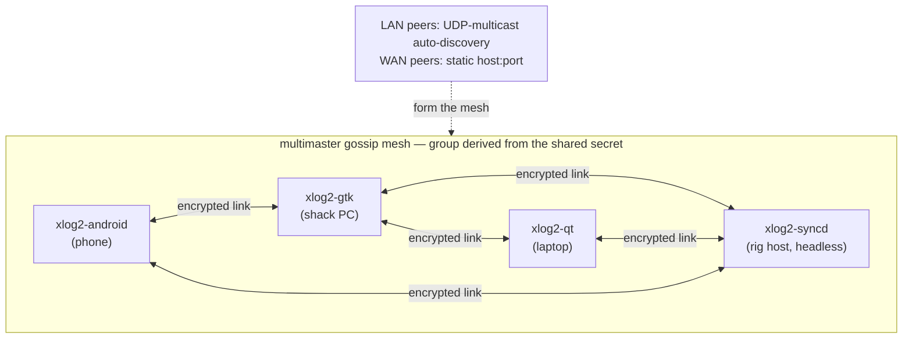

The first two posts covered [the story]() and [how to set everything up](). This one is for the curious: the two bits of hamtools I'm most pleased with: keying CW over a jittery network without wrecking the timing and keeping one logbook in sync across every machine with no server.

## Keying CW over the internet

Here's the problem. You want to send real, paddle-formed Morse, but the transmitter is on the other end of an unreliable network. The naive approach — sample the paddle, send "key down" / "key up" packets, and drive the rig's keying line directly from whenever those packets arrive — sounds *terrible*. Network jitter lands directly on your dit/dah timing, and Morse whose element lengths wobble is Morse nobody can copy.

The hamtools answer splits the job across the exact boundary where it belongs:

1. **The paddle → xlog2 (local, jitter-free).** The USB paddle delivers edges to xlog2 in ~1 ms. xlog2 runs the **iambic keyer state machine locally** and generates **instant local sidetone**. All the timing-sensitive work happens on hardware you can trust. The keyer's *output* — clean, correctly-timed key edges — is stamped with timestamps from a local clock and streamed as UDP datagrams.

2. **xlog2 → cwsd (over the network, timing-insensitive).** The datagrams are just "edge X happened at time T." Order and exact arrival time no longer matter for *timing*, only for *deadline*.

3. **cwsd replays behind a fixed playout delay.** This is the trick. cwsd's `remote_key_server` doesn't run a keyer at all — it's a **replay engine with a jitter buffer.** It anchors the operator's timeline to local time offset by a fixed *playout delay* (150 ms by default) and schedules each edge onto the rig's DTR/RTS lines with `clock_nanosleep(TIMER_ABSTIME)` on a dedicated real-time thread. As long as a packet arrives before its scheduled playout slot — and 150 ms is a lot of network slack — the on-air element timing is **exactly** what your paddle produced. Jitter is absorbed by the buffer instead of distorting your fist.

The felt experience is semi-break-in: your sidetone is instant (local), and the transmitted signal follows a fixed delay behind it. There are the safety rails you'd want on a keying line you can't see — force key-up after a silence gap, re-anchor the clock after silence, and a hard watchdog that never holds the key down beyond a few seconds if something goes wrong. A straight key, incidentally, is just the degenerate case: raw edges with no keyer in front of them.

That's the whole design philosophy of the suite in one feature. Do the latency-critical work where the latency is low (at the paddle, on local hardware), push *timestamps* not *timing* across the network, and reconstruct on the far side behind a buffer. Every component earns its place in that chain: **usb-paddles** gives jitter-free input, **xlog2** owns the keyer and the operator's clock, and **cwsd** owns the deadline-scheduled replay next to the rig.

## The sync mesh

A logging setup that spans machines needs the *log* to span machines too. It would be tempting to reach for a server and a "sync" button, but that's the wrong shape for a hobby station — I don't want a piece of infrastructure I have to keep running just so my phone and my shack PC agree on who I worked.

So logbook sync is **peer-to-peer and multi-master.** Every node both listens and dials; there is no server and no listener/connector role to configure. Instances auto-discover each other on the LAN via UDP multicast (and take static `host:port` peers for crossing the internet), form an encrypted mesh, and converge. This is the `multimaster` gossip library doing the discovery, dial-race resolution, relaying and reconnection; xlog2 layers the logbook protocol and the merge on top.

Every node is symmetric — same core, same `default.xlog`, no server. LAN peers find each other by multicast; a `host:port` static peer stitches in a node across the internet. The headless `xlog2-syncd` is just another peer, usually the one that's always awake.

The merge is **last-write-wins per QSO.** Each contact carries a stable cross-machine UUID and an `updated_at` millisecond timestamp; the newer write wins, ties break deterministically on node id, and deletes leave **tombstones** so a removed QSO doesn't quietly reappear from a peer that hadn't heard about the deletion. Old `.xlog` files are migrated transparently on open, and — a detail I'm fond of — pre-existing rows are back-filled with *content-hashed* UUIDs, so two machines that both started from a copy of the same logbook assign the same id to the same QSO. The first sync between them is then a no-op instead of a flood of duplicates.

**One knob drives all of it: the shared secret.** Set the same secret on every machine and you're done. That secret selects the mesh (the group id is derived from it, so different-secret instances never even connect), doubles as the transport **PSK** — libsodium mutually authenticates and encrypts every link (X25519 → ChaCha20-Poly1305, per-connection forward secrecy) — and seeds a per-node **self-certifying Ed25519 identity**, so a peer's mesh id actually *proves* ownership of its key and nodes can't impersonate one another. On top of that there's an app-layer **trust allowlist**: an identity-verified peer still gets nothing until you admit it under *Sync ▸ Trusted peers*. QSO data is never on the wire in the clear; you don't need a VPN tunnel for privacy anymore (though one still works fine).

## Wrapping up

None of these tools is large, and each one stands on its own — cwsd is a fine generic rig daemon, xlog2 is a fine standalone logger, usb-paddles is a fine low-latency raw-HID paddle. But the reason they exist together is that once you commit to "the radio is just another thing on the network," a whole station composes out of small, single-purpose services talking IP. The remote-keying chain is the proof that it can be done without compromising the thing hams care about most — clean CW.

That's the series: [part 1]() for the why, [part 2]() for the how-to. The projects are all GPL-3.0, with detailed `README` and design-notes (`CLAUDE.md`) in each repo:

- **cwsd** — <https://github.com/yo6ssw/cwsd>
- **xlog2** — <https://github.com/yo6ssw/xlog2>
- **usb-paddles** — <https://github.com/yo6ssw/usb-paddles>
- **hamtools hub** (docs entry point) — <https://github.com/yo6ssw/hamtools>

73 · YO6SSW
