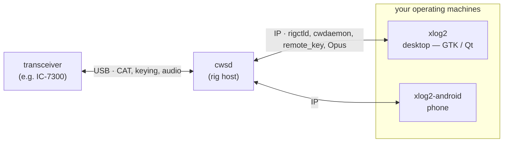

This is the practical part of the [hamtools story](/posts/hamtools-logging-stack/), a tour of the three components, what each does and how to install and configure it. A [third post](/posts/hamtools-how-it-works/) then digs into the two pieces I'm proudest of. Everything is GPL-3.0, and every component talks over IP, so "local" and "remote" are the same setup with different addresses.

## Components

The shape of it: **cwsd** sits next to the radio and puts it on the network; **xlog2** (and its mobile sibling) drive it from wherever you happen to be.



### cwsd

**cwsd** is the piece that lives next to the radio. It links [hamlib](https://hamlib.sourceforge.net/) for CAT control and turns a single USB-connected transceiver (developed against the Icom IC-7300) into a set of independent, individually-toggled network services, each on its own port:

| Service | Port | Default | Purpose |
|---------|------|---------|---------|
| `rigctld` | TCP 4532 | on | hamlib rigctld protocol — query/set frequency, mode, PTT, VFO (WSJT-X, fldigi, xlog2, …) |
| `cwdaemon` | UDP 6789 | on | receive text and key it as Morse (DTR = key, RTS = PTT) |
| `audio stream` | UDP 7355 | off | capture rig RX audio, Opus-encode, fan out to subscribers |
| `remote key` | UDP 6790 | off | replay timestamped paddle edges — real keying over the internet |

Because the first two speak the *standard* rigctld and cwdaemon protocols, cwsd is useful well beyond this stack: point WSJT-X or fldigi at `RIGHOST:4532` and you're controlling a rig on another machine.

> `cwdaemon` and `remote_key` both drive the same DTR/RTS control lines, so if you enable both on a given serial device, try not to send a CW macro while using remote keying — or vice versa. They're alternative keying front-ends which should not be used at the same time.

**INSTALL**

On current Ubuntu releases it's a package on my PPA — no compiling:

```sh
sudo add-apt-repository ppa:benishor/hamtools
sudo apt update
sudo apt install cwsd
```

That drops in the binary, a `systemd` service unit and a sample config.

If you are using other distributions or Raspberry Pi OS, you can grab a self-contained static `x86_64`/`arm64` binary from the [releases](https://github.com/yo6ssw/cwsd/releases) page.

If you want to build from sources, you need CMake ≥ 3.25, a C++20 compiler and the hamlib/ALSA/Opus development libraries:

```sh
sudo apt install libhamlib-dev libasound2-dev libopus-dev cmake build-essential
git clone https://github.com/yo6ssw/cwsd.git
cd cwsd
cmake -S . -B build -DCMAKE_BUILD_TYPE=Release
cmake --build build -j
sudo cmake --install build
```

> One scar worth passing on: hamlib breaks its ABI within the 4.x series while keeping the `libhamlib.so.4` soname, so **after any hamlib upgrade you must rebuild cwsd**. Otherwise the old binary keeps linking and running — audio still streams — but the `rigctld` service silently returns nothing to every command and CAT clients just time out. "It still runs" is not proof it works.

**CONFIGURE**

Despite the `rc` name, the config is YAML. From the PPA the service reads a *system* config at `/etc/cwsd/cwsdrc`, so copy the shipped sample and edit it:

```sh
sudo cp /etc/cwsd/cwsdrc.sample /etc/cwsd/cwsdrc
sudo editor /etc/cwsd/cwsdrc     # set rig.port and rig.model
```

Each service has its own `enabled` flag and port; `rig.model` is the hamlib model number (`3073` = IC-7300) and `rig.port` is the serial device:

```yaml
rig:
  port: /dev/icom7300      # stable udev symlink to the rig's serial device
  model: 3073              # hamlib rig model number (3073 = IC-7300)
cwdaemon:
  enabled: true
  port: 6789
  initial_wpm: 40
rigctld:
  enabled: true
  port: 4532
audio:
  enabled: false
  device: pipewire         # RX via PipeWire, shared with WSJT-X (or plughw:0,0 for the raw card)
  port: 7355               # clients subscribe by sending a datagram here
  sample_rate: 8000        # Opus rates only: 8000/12000/16000/24000/48000
remote_key:
  enabled: false
  port: 6790
  playout_ms: 150          # jitter-buffer depth; the rig lags the operator by this much
```

The package installs a `cwsd.service` unit but deliberately doesn't enable or start it. Nothing runs until you've written the config above and then:

```sh
sudo systemctl enable --now cwsd
journalctl -u cwsd -f             # follow the logs
```

The service runs as an unprivileged, transient `DynamicUser` (no root, no login account) that's added to the `dialout` and `audio` groups so it can reach the rig's serial line and sound card, and granted just enough real-time capability for the keyer thread.


The package also ships a udev rule that gives the rig a stable `/dev/icom7300` symlink, so the config doesn't depend on USB enumeration order. If you have a different rig, you can follow the shipped example and create your own.

For a quick manual run instead, handy while testing, just launch it in the foreground with `cwsd` (or `cwsd -d` to daemonize). Run that way, with no `--config`, it falls back to a per-user `~/.config/cwsdrc`; the systemd unit passes `--config /etc/cwsd/cwsdrc` explicitly.

The whole install, start to finish, recorded as an [asciinema](https://asciinema.org/) session:

<link rel="stylesheet" href="https://cdn.jsdelivr.net/npm/asciinema-player@3.8.0/dist/bundle/asciinema-player.css">
<div id="cwsd-install-cast"></div>
<script src="https://cdn.jsdelivr.net/npm/asciinema-player@3.8.0/dist/bundle/asciinema-player.min.js"></script>
<script>
  AsciinemaPlayer.create(
    '/assets/install-cwsd.cast',
    document.getElementById('cwsd-install-cast'),
    { fit: 'width' }
  );
</script>

### xlog2

**xlog2** is the logger and the operator console, a desktop amateur-radio logging program (a modern clone of [xlog](https://www.nongnu.org/xlog/), in C++20), built as a toolkit-neutral core with two interchangeable frontends: **xlog2-gtk** (GTK 4) and **xlog2-qt** (Qt 6).

Both read and write the same `.xlog` SQLite logbooks and the same settings, so you can switch between them freely. On its own it handles the usual logging chores, live dupe detection, frequency→band, ADIF import/export, per-band/mode stats, DXCC from `cty.dat`, QRZ.com prefill, LoTW upload/confirmation via `tqsl`.

<figure class="post-figure" markdown="0">
  <a href="/assets/xlog2-overview.png" data-lightbox="xlog2-desktop" data-title="xlog2-qt — the desktop logger and operator console">
    
  </a>
  <figcaption>xlog2-qt on the laptop — logbook, band map and rig control in one console.</figcaption>
</figure>

Point it at a running **cwsd** and it also becomes the station's control surface:

| Talks to | Via | For |
|----------|-----|-----|
| cwsd / rig | rigctld TCP 4532 | CAT — frequency, mode, PTT, band switching |
| cwsd | cwdaemon UDP 6789 | send CW — F1–F9 macros and typed text |
| cwsd | remote_key UDP 6790 | real paddle keying over the network |
| cwsd | Opus UDP 7355 | RX audio playback + the CW Skimmer decoder |
| other xlog2 nodes | multimaster mesh | peer-to-peer logbook sync |
| QRZ.com · LoTW · DX-cluster | HTTPS · `tqsl` · telnet | lookups, confirmations, spots |

**INSTALL**

Same PPA as cwsd, pick a frontend:

```sh
sudo add-apt-repository ppa:benishor/hamtools
sudo apt update
sudo apt install xlog2-qt        # Qt 6 frontend (or: xlog2-gtk for GTK 4)
```

Optional extras: `xlog2-data` (world-map coastline) and `xlog2-syncd` (the headless sync peer — more below).

For Debian, Raspberry Pi OS or anything non-Ubuntu, grab the self-contained **Qt AppImage** from the [releases](https://github.com/yo6ssw/xlog2/releases). It bundles Qt 6, so it doesn't need a recent system GTK. LoTW still needs `tqsl` on the host.

If you want to build from source you need a C++20 compiler, CMake ≥ 3.16, and gtkmm-4 and/or Qt 6 plus the SQLite/Hamlib/libcurl/Opus/PipeWire/D-Bus/libsodium dev packages:

```sh
sudo apt install build-essential cmake pkg-config \
    libgtkmm-4.0-dev qt6-base-dev \
    libsqlite3-dev libhamlib-dev libcurl4-openssl-dev \
    libopus-dev libasound2-dev libpipewire-0.3-dev libdbus-1-dev \
    libsodium-dev
sudo apt install tqsl                 # runtime only, for LoTW upload
git clone --recurse-submodules https://github.com/yo6ssw/xlog2.git
cd xlog2
cmake -S . -B build && cmake --build build -j     # builds both frontends
```

Clone with `--recurse-submodules` so it pulls in `multimaster`, the mesh library dependency.

You can build just one frontend with `-DXLOG_BUILD_GTK=OFF` or `-DXLOG_BUILD_QT=OFF`. The binaries land at `build/xlog2-gtk` and `build/xlog2-qt`.

**CONFIGURE**

Unlike cwsd, xlog2 is configured from its in-app _Settings_ dialog rather than a hand-edited file and the settings are persisted in a plain INI at `~/.config/xlog2/layout.ini`.

Your data (the `default.xlog` logbook, plus optional `cty.dat` for DXCC and `master.scp` for the skimmer) lives under `~/.local/share/xlog2/`.

The settings worth knowing:

- **Station** — your callsign and Maidenhead locator.
- **Rig/CW/audio** — the **cwsd** host, so CAT (4532), CW keying (cwdaemon 6789), paddle keying (remote_key 6790) and the RX Opus stream (7355) all point at the box by your radio.
- **Lookups** — QRZ.com credentials; drop `cty.dat` and `master.scp` into the data dir.
- **Sync** — the one knob that matters: set the _same_ shared secret on every node and they form one encrypted, self-discovering mesh. In `layout.ini` that's:

```ini
[sync]
secret = a-high-entropy-shared-secret     # identical on every node
```

<figure class="post-figure" markdown="0">
  <a href="/assets/xlog2-trust.png" data-lightbox="xlog2-desktop" data-title="xlog2 — trusting a peer node on the sync mesh">
    
  </a>
  <figcaption>Nodes sharing the secret discover each other and ask to be trusted before joining the mesh.</figcaption>
</figure>

For an always-on backup that keeps the logbook merged even when your machines are asleep, you can make use of xlog-syncd.

Install it with `sudo apt install xlog2-syncd`, set the same `[sync] secret`, then start it with `systemctl --user enable --now xlog2-syncd` (with `sudo loginctl enable-linger "$USER"` so it survives logout and runs at boot).

Inspect logs with `journalctl --user -u xlog2-syncd -f`.

**ANDROID**

There's a mobile frontend, too: **xlog2-android**, a Kotlin/Jetpack Compose app that runs the *same* `xlog_core` over JNI — so a QSO logged on the phone joins the very same mesh as everything else. Built entirely from FOSS pieces (no Google libraries), it's on F-Droid, or you can grab the signed APK from the [releases](https://github.com/yo6ssw/xlog2/releases).

With a USB-OTG cable it even reads the same paddle for field CW, which is what finally made portable operating with the KX3 or QMX+ pleasant.

<div class="screenshot-gallery" markdown="0">
  <a href="/assets/xlog2-android-list.jpg" data-lightbox="xlog2-android" data-title="xlog2-android — the logbook, live on the mesh">
    
  </a>
  <a href="/assets/xlog2-android-new-qso.jpg" data-lightbox="xlog2-android" data-title="xlog2-android — logging a new QSO">
    
  </a>
  <a href="/assets/xlog2-android-rig-audio.jpg" data-lightbox="xlog2-android" data-title="xlog2-android — rig and RX audio pointed at cwsd">
    
  </a>
  <a href="/assets/xlog2-android-paddles.jpg" data-lightbox="xlog2-android" data-title="xlog2-android — paddle keyer over USB-OTG">
    
  </a>
  <a href="/assets/xlog2-android-trust.jpg" data-lightbox="xlog2-android" data-title="xlog2-android — trusting the sync mesh">
    
  </a>
</div>

### usb-paddles

**usb-paddles** is firmware, not something you install on the PC — it runs on an STM32F411 board (typically [Black Pill](https://stm32-base.org/boards/STM32F103C8T6-Black-Pill.html) but I chose a Romanian [Magma Splash](https://ardushop.ro/en/development-boards/2184-groundstudio-magma-splash-6427854033680.html) for different reasons) and turns two paddle contacts into a vendor-defined (raw) USB HID device.

Because it lives on a vendor usage page instead of pretending to be a keyboard, no OS input subsystem interprets it: it never types into the focused window, and only software that knows the report format reads it. It has sub-millisecond latency by design.

<figure class="post-figure" markdown="0">
  <a href="/assets/usb-paddles.jpg" data-lightbox="usb-paddles" data-title="usb-paddles — STM32F411 raw-HID keyer">
    
  </a>
  <figcaption>The usb-paddles board — two paddle contacts to a vendor-defined USB HID device.</figcaption>
</figure>

**INSTALL**

It's a [PlatformIO](https://platformio.org/) project which you can build and flash over an ST-Link/V2 on SWD, no USB bootloader needed:

```sh
git clone https://github.com/yo6ssw/usb-paddles.git
cd usb-paddles
pio run                 # build
pio run -t upload       # flash via ST-Link (SWDIO=PA13, SWCLK=PA14, GND, 3V3)
```

After flashing, unplug/replug the board so the host re-enumerates it. Wire each paddle contact straight to `GND` — `PA0` for dit, `PA1` for dash.

> The `master` branch is this STM32F411 + TinyUSB build; an older `raw-hid` branch targets the STM32F103 [Blue Pill](https://stm32-base.org/boards/STM32F103C8T6-Blue-Pill.html) which I abandoned due to its microusb connector type. The on-wire identity and report are identical across both, so xlog2 reads either — only pick `raw-hid` if that's the board you have.

**CONFIGURE**

There's nothing to set on the device itself, the host decides what dit and dash mean. On the PC you only need read access to the raw-HID node, which is root-only by default, so install the shipped udev rule once so xlog2 (running as your user) can open it:

```sh
sudo cp udev/60-xlog2-paddle.rules /etc/udev/rules.d/
sudo udevadm control --reload-rules && sudo udevadm trigger
```

Replug the board and confirm it enumerated with `lsusb | grep 1eaf:0024`. From there, point xlog2's paddle keyer at the device and you're keying — locally, or streamed through cwsd's `remote_key` service for the full over-the-internet chain.

## Wrapping up

That's the whole station stood up: **cwsd** by the radio, **xlog2** (with its mobile and headless siblings) wherever you operate from, and **usb-paddles** for a real key. Each piece is useful on its own; together they turn one rig into a network- and internet-operable station.

Where to next? [Part 1](/posts/hamtools-logging-stack/) tells the story of how these came to be, and [part 3](/posts/hamtools-how-it-works/) digs into how the internet CW keying and the logbook sync mesh actually work.

The projects are all GPL-3.0, with detailed `README` and design-notes (`CLAUDE.md`) in each repo:

- **cwsd** — <https://github.com/yo6ssw/cwsd>
- **xlog2** — <https://github.com/yo6ssw/xlog2>
- **usb-paddles** — <https://github.com/yo6ssw/usb-paddles>
- **hamtools hub** (docs entry point) — <https://github.com/yo6ssw/hamtools>

73 · YO6SSW
